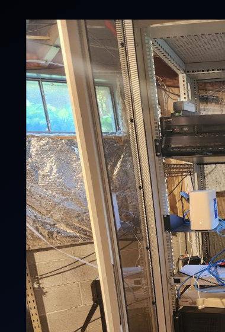

  <h1>Deevnet Infrastructure Platform</h1>
  
Hardware, automation, and documentation for building reproducible on-premise infrastructure.

## Two Deployments

{}

### Deevnet Mobile (dvntm)

A **portable lab** that packs into a toolkit. Includes:

- Network infrastructure (router, switch, wireless AP)
- Compute nodes (Proxmox hypervisors, Raspberry Pis)
- Breadboards and components for embedded device prototyping
- Full on-premise network that can be set up anywhere

Deevnet Mobile provides a complete, self-contained environment for development, testing, and demos — whether at home, a coffee shop, or a Meetup site.

<--->

### Deevnet Home (dvnt)

A **home infrastructure** deployment supporting various functions:

- Permanent compute and storage
- Home automation and IoT backends
- Development and CI/CD environments
- Media and personal services

{}

---

## Explore the Documentation

  <a class="section-card" href="docs/architecture/">
    <h3>Architecture</h3>
    
Substrates, tenants, and system-level design intent.

  </a>
  <a class="section-card" href="docs/standards/">
    <h3>Standards</h3>
    
Non-negotiable rules for naming, correctness, and identity.

  </a>
  <a class="section-card" href="docs/platforms/">
    <h3>Platforms & Tooling</h3>
    
Hardware and software platform decisions with rationale.

  </a>
  <a class="section-card" href="docs/runbook/">
    <h3>Operational Runbook</h3>
    
Step-by-step procedures for operating and maintaining infrastructure.

  </a>
  <a class="section-card" href="docs/roadmap/">
    <h3>Roadmap</h3>
    
Forward-looking project plans and progress tracking.

  </a>
  <a class="section-card" href="docs/github/">
    <h3>Code Repositories</h3>
    
GitHub repos, layout, and getting started guides.

  </a>

---

## Adaptability

While this project targets specific hardware, the patterns, automation, and documentation are designed to be **adaptable to any infrastructure**. The standards and architecture defined here can be applied to your own collection of devices and networks.

---

## Documentation Philosophy

This documentation exists to:
- seed context to AI agent tooling,
- make intent explicit,
- prevent knowledge from living only in someone's head,
- and ensure future changes remain coherent.

{}
If something "works" but violates these documents, it is considered **incorrect**.
{}
