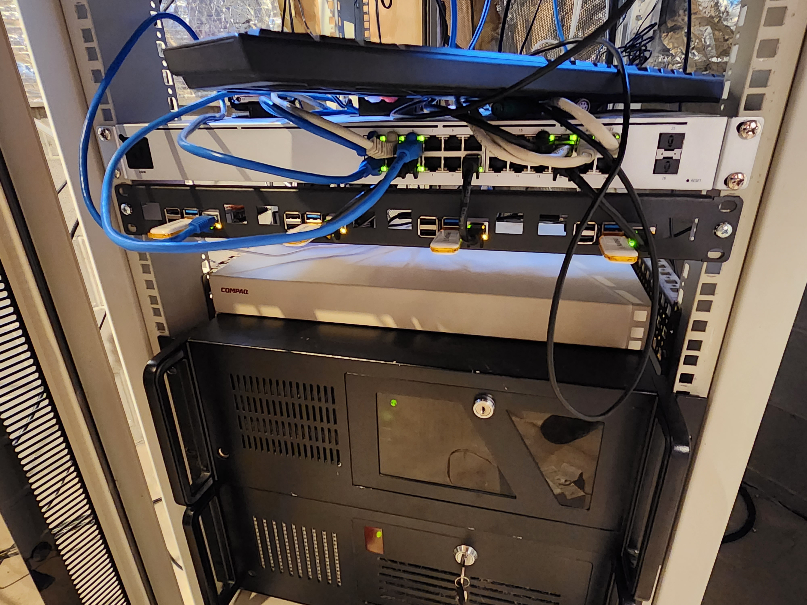

# Deevnet Infrastructure Platform

<em>Infrastructure. Automated. Reproducible. Documented.</em>

{}

### Deevnet Mobile (mobile)

**A cloud you can carry.** Set it up on-premise, anywhere, and get:

- **Portable network addressing.** Its address space and DNS zone travel with the case: the same
  addresses and names on the road or at home, with no renumbering.
- **IoT as a Service.** Per-device Wi-Fi keys, scoped MQTT accounts and a device registry, all from
  Terraform. *(in&nbsp;development)*
- **Self-service tenants.** Isolated networks, DNS zones and state storage, from the tenant's own
  code.
- **Works offline.** Builds and rebuilds itself from code, with no internet needed.
- **A bench for its devices.** Prototype embedded hardware right beside the platform.

<small>In the case: router, switch, wireless AP, Proxmox hypervisors, Raspberry Pis, and
breadboards and components.</small>

<--->

### Deevnet Home (home)

A **home infrastructure** deployment supporting various functions:

- Permanent compute and storage
- Home automation and IoT backends
- Development and CI/CD environments
- Media and personal services

{}

---

## Explore the Documentation

  <a class="section-card" href="docs/architecture/">
    <h3>Architecture</h3>
    
Sites, substrates, tenants, and system-level design intent.

  </a>
  <a class="section-card" href="docs/standards/">
    <h3>Standards</h3>
    
Non-negotiable rules for naming, correctness, and identity.

  </a>
  <a class="section-card" href="docs/platforms/">
    <h3>Implementation & Tooling</h3>
    
Hardware and software platform decisions with rationale.

  </a>
  <a class="section-card" href="docs/runbook/">
    <h3>Operational Runbook</h3>
    
Step-by-step procedures for operating and maintaining infrastructure.

  </a>
  <a class="section-card" href="docs/changes/">
    <h3>Change Records</h3>
    
Significant changes, one dated record each — goal, procedure, undo, outcome.

  </a>
  <a class="section-card" href="docs/incidents/">
    <h3>Incident Records</h3>
    
What broke, how it was found, why, and what was done so it does not happen again.

  </a>
  <a class="section-card" href="docs/roadmap/">
    <h3>Roadmap</h3>
    
Forward-looking project plans and progress tracking.

  </a>
  <a class="section-card" href="docs/github/">
    <h3>Code Repositories</h3>
    
GitHub repos, layout, and getting started guides.

  </a>

---

## Adaptability

While this project targets specific hardware, the patterns, automation, and documentation are designed to be **adaptable to any infrastructure**. The standards and architecture defined here can be applied to your own collection of devices and networks.

---

## Documentation Philosophy

This documentation exists to:
- seed context to AI agent tooling,
- make intent explicit,
- prevent knowledge from living only in someone's head,
- and ensure future changes remain coherent.

{}
If something "works" but violates these documents, it is considered **incorrect**.
{}
