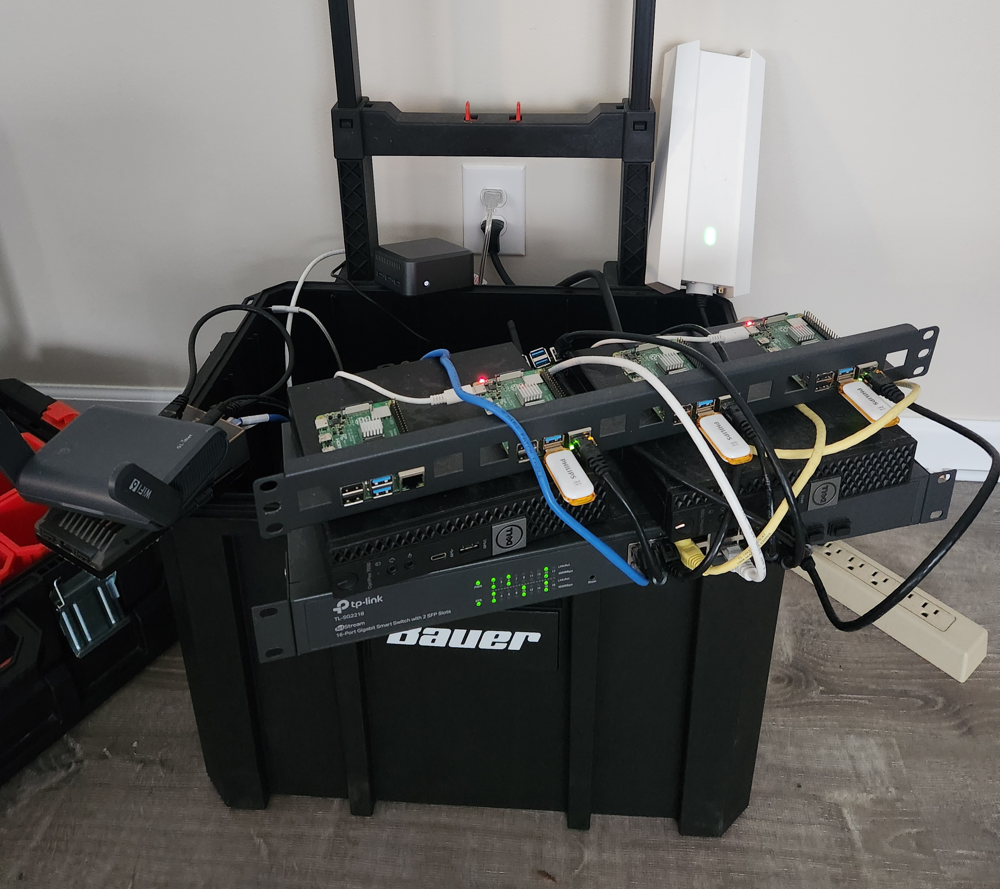

# Deevnet IoT as a Service

<em>Mobile Factory</em>

**A cloud you can carry.** The Mobile Factory is a portable IoT platform, bundled in the base of a
modular toolkit. Set it up on site, and the people in the room get a network for their devices, MQTT
messaging, and logs and dashboards, all declared from their own Terraform, with no public cloud.

## Why I built this

I'm a member of the [Columbus Arduino and Raspberry Pi Enthusiasts](https://carpe-tech.org). I built
the Mobile Factory for my own projects: I wanted to build things on site at meetups, and that meant
bringing my own network. Then I wanted to make it something everyone else could use too.

Like a typical engineer, I couldn't just build the thing. First I had to build the thing that builds
the thing. So the network, the services and the images it runs are all automated and built from code,
and everything can be rebuilt from scratch. Somewhere along the way it became a reference
implementation for infrastructure automation.

It's all bundled in the base of a Bauer modular toolkit, so the device components and tools come on
site with it, ready for hardware hacks and prototyping.

## Come build with it

**If you're local to Columbus, Ohio**, come to a [CARPE](https://carpe-tech.org) meetup. Bring your
breadboard, microcontrollers and sensors, and you can rapidly prototype a multi-device project with
the backend services already running:

- **Messaging and logging are already decided**, with an opinionated approach:
  [MQTT with an account per device](/docs/runbook/tenant/services/devices-and-mqtt/), and
  [logs](/docs/runbook/tenant/services/logs/) you can chart in your own
  [dashboards](/docs/runbook/tenant/services/dashboards/). You spend the evening on your devices and
  what they do, not on standing up a broker.
- **No public cloud.** Your devices talk to services in the room. There's no cloud account to sign
  up for, and nothing leaves the site.
- **Bring a microSD card**, and you can take your backend home with you, to run on a Pi of your own
  ([Take It Home on a Pi](/docs/runbook/tenant/take-it-home/)). Bring a laptop too:
  [Before You Start](/docs/runbook/tenant/getting-started/before-you-start/) says what to have on it.

**If you're not local**, [the code](/docs/github/) and these docs are open. Use them and adapt them
for your own lab, or, these days, have your favorite AI agents adapt them for you.

## Features

A tenant declares what it needs in its own Terraform and gets:

- **A network for its devices.** Its own Wi-Fi key on the IoT network, issued to the tenant by the
  API, with no one touching the controller.
- **MQTT.** Broker accounts scoped to the tenant's own topics, and a registry of its devices.
- **Logs and dashboards.** Its workloads' and devices' logs in a store only it can read, and its own
  Grafana organisation to chart them.
- **Isolated workloads.** Its own network, DNS zone and state storage, rebuilt from its code.

## What makes it a factory

- **It builds everything from code**: its network, its services and the images it runs, and it works
  offline once it is set up.
- **It produces what tenants take away**: the take-home Pi kit, which reproduces the same services on a
  single Raspberry Pi, and the prebuilt provider and tools a developer needs on their own laptop.
- **It travels.** Its address space and DNS zone move with the toolkit, so it is the same factory wherever
  it is set up, with no renumbering.

<small>In the toolkit's base: router, switch, wireless AP, two Proxmox hypervisors and Raspberry Pis.
The rest of the toolkit carries the breadboards, components and tools for prototyping devices.</small>

---

## Explore the Documentation

  <a class="section-card" href="docs/architecture/">
    <h3>Architecture</h3>
    
Sites, substrates, tenants, and system-level design intent.

  </a>
  <a class="section-card" href="docs/standards/">
    <h3>Standards</h3>
    
Non-negotiable rules for naming, correctness, and identity.

  </a>
  <a class="section-card" href="docs/policies/">
    <h3>Policies & Procedures</h3>
    
Change, incident, risk and lifecycle management, including certification.

  </a>
  <a class="section-card" href="docs/platforms/">
    <h3>Implementation & Tooling</h3>
    
Hardware and software selections with rationale, the software catalog, and certifications.

  </a>
  <a class="section-card" href="docs/runbook/">
    <h3>Operational Runbook</h3>
    
Step-by-step procedures for operating the factory, and guides for its tenants.

  </a>
  <a class="section-card" href="docs/changes/">
    <h3>Change Records</h3>
    
Significant changes, one dated record each — goal, procedure, undo, outcome.

  </a>
  <a class="section-card" href="docs/incidents/">
    <h3>Incident Records</h3>
    
What broke, how it was found, why, and what was done so it does not happen again.

  </a>
  <a class="section-card" href="docs/roadmap/">
    <h3>Roadmap</h3>
    
Forward-looking project plans and progress tracking.

  </a>
  <a class="section-card" href="docs/github/">
    <h3>Code Repositories</h3>
    
GitHub repos, layout, and getting started guides.

  </a>

---

## One instance of Deevnet

This site documents the Mobile Factory, the mobile instance of Deevnet. **Architecture, Standards and
Policies** are written for any Deevnet site. **Implementation & Tooling, the Runbook, the records and
the Roadmap** are this instance's. Another site would be its own instance, and would more likely run
a variant of the take-home kit than a factory of its own.

The patterns, automation and documentation are meant to be adaptable: the standards and architecture
can be applied to your own collection of devices and networks.

---

## Documentation Philosophy

This documentation exists to:
- seed context to AI agent tooling,
- make intent explicit,
- prevent knowledge from living only in someone's head,
- and ensure future changes remain coherent.

{}
If something "works" but violates these documents, it is considered **incorrect**.
{}
