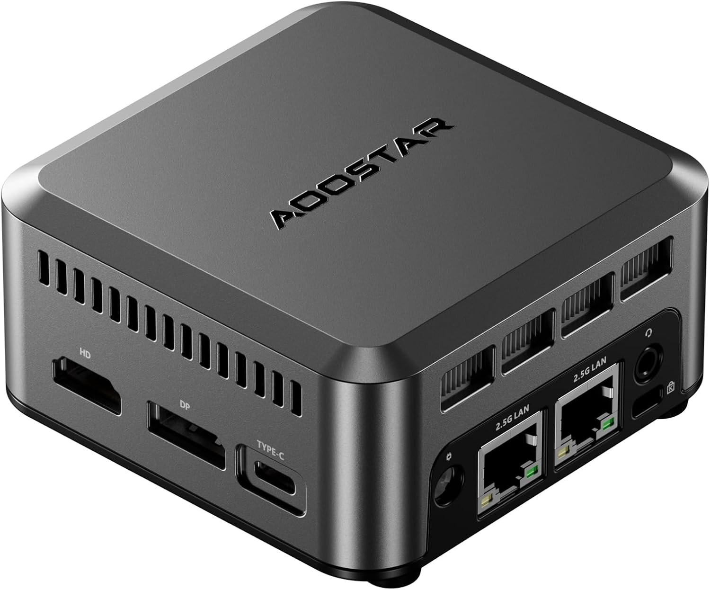

# AOOSTAR N1 PRO

A compact mini PC, used as the mobile site's Builder: its bootstrap node. Its two 2.5GbE NICs give
it the upstream and site connections the bootstrap role needs.

## Specs

| Attribute | Value |
|-----------|-------|
| **Model** | AOOSTAR N1 PRO |
| **CPU** | Intel N150 (upgraded N100 variant) |
| **Memory** | 12GB LPDDR5 |
| **Storage** | 1TB NVMe SSD (WD_BLACK SN770M) |
| **Ethernet** | 2x 2.5GbE (Intel i226-V) |
| **Wi-Fi** | Realtek RTL8821CE (802.11ac). Present, not used |
| **Form factor** | Mini PC |
| **Cooling** | Active (fan) |

## Selection Rationale

- **Dual 2.5GbE NICs** for upstream + substrate connectivity (bootstrap requirement)
- **Compact form factor** for dedicated always-on bootstrap role
- **12GB RAM** sufficient for artifact serving and Ansible execution
- **1TB storage** for ISOs, images, and boot artifacts
- **Intel i226-V NICs** for reliable network performance

## In Service

| Host | Role |
|---|---|
| `dv00bld001p01` | The Builder: [Bootstrap Node](/docs/platforms/management-plane/bootstrap-node/) |

## Physical

| NIC | Use | Connects to |
|---|---|---|
| `enp4s0` (inventory `eth0`) | Management | Switch `gi1/0/16`, access, VLAN 99 |
| `enp1s0` (inventory `eth1`) | Upstream | The [edge router](/docs/hardware/network/gl-inet-slate-ax/)'s LAN, directly |

- **Wake-on-LAN:** enabled on both wired NICs.
- **Power and console:** not documented. There is no console recovery page for the Builder yet.

## Firmware

The BIOS version is in the
[Software Catalog](/docs/platforms/software-catalog/#builder-dv00bld001p01-and-the-provisioner-vms).

## Certification

| | |
|---|---|
| **Role** | Builder (bootstrap node) |
| **Current** |  In service from before the [Certification](/docs/policies/lifecycle-management/certification/) policy |

### Revisions

None yet.
