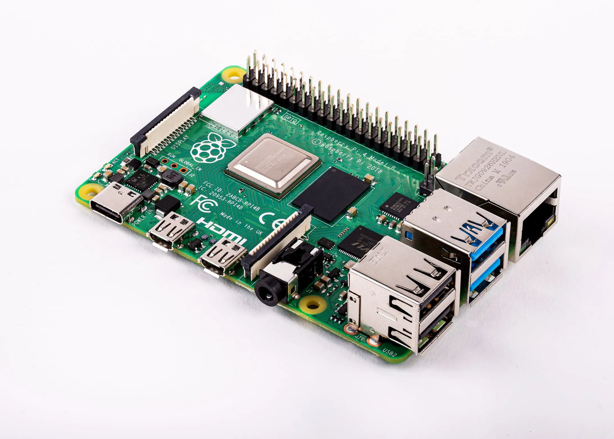

# Raspberry Pi 4 Model B

The Pi bank: four Raspberry Pi 4s used as a development and prototyping workbench for edge, IoT and
hardware projects.

## Specs

| Attribute | Value |
|-----------|-------|
| **Model** | Raspberry Pi 4 Model B |
| **Memory** | 8GB |
| **Storage** | microSD card |
| **Ethernet** | 1x Gigabit |

## Selection Rationale

| Attribute | Value | Rationale |
|-----------|-------|-----------|
| **Model** | Pi 4 Model B | Mature platform, broad software support |
| **RAM** | 8GB | Maximum available, supports heavier workloads |
| **Quantity** | 4 units | Enables clustering experiments (K3s, etc.) |
| **Form factor** | Standard Pi | Compatible with cases, HATs, accessories |

## In Service

| Host | Switch port | Notes |
|---|---|---|
| `dv02rpi001p01` | `gi1/0/14`, access, VLAN 30 | Also the `sdr` host: [CaribouLite SDR](/docs/completed/cariboulite-sdr/) |
| `dv02rpi002p01` | `gi1/0/3`, access, VLAN 30 | |
| `dv02rpi003p01` | none declared | |
| `dv02rpi004p01` | `gi1/0/5`, access, VLAN 30 | |

How the bank is used is the [Raspberry Pi](/docs/platforms/tenant-compute/raspberry-pi/) page and
the [Pi Lab](/docs/runbook/tenant/pi-lab/).

## Physical

- **Network:** each Pi is on the IoT segment, VLAN 30. Declare a switch port before cabling a Pi:
  an undeclared port is untagged VLAN 1 and the Pi looks dead
  ([CHG-0027](/docs/changes/2026/0027-rpi004-switch-port/)).
- **Power:** not documented.
- **Console:** the image-factory Pi images enable the serial UART (`enable_uart=1`).

## Firmware

The bootloader EEPROM version is not recorded. The OS on each Pi is in the
[Software Catalog](/docs/platforms/software-catalog/#raspberry-pi).

## Certification

| | |
|---|---|
| **Role** | Pi bank |
| **Current** |  In service from before the [Certification](/docs/policies/lifecycle-management/certification/) policy |

### Revisions

None yet.
