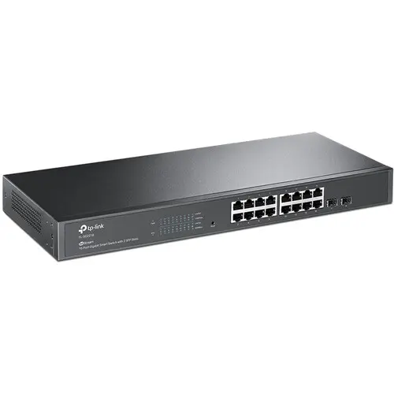

# TP-Link Omada SG2218

A managed Gigabit switch from TP-Link's Omada line, used as the mobile site's access switch.

## Specs

| Attribute | Value |
|-----------|-------|
| **Model** | TP-Link Omada SG2218, hardware 1.20 |
| **Ports** | 16x Gigabit RJ45 |
| **Uplinks** | 2x SFP (1Gbps) |
| **PoE** | None: the AP runs from its own injector |
| **Switching Capacity** | 36 Gbps |
| **MAC Table** | 8K entries |
| **Jumbo Frames** | 9216 bytes |
| **Power** | 8.65W max |
| **Dimensions** | 294 x 180 x 44mm |
| **Mounting** | Desktop or rack (1U) |
| **Cooling** | Fanless |

## Selection Rationale

- **VLAN support**: 802.1Q VLAN tagging for network segmentation
- **SSH access**: CLI configuration for automation
- **Omada SDN**: Centralized management via Omada controller
- **Compact**: Fits mobile site form factor
- **SFP uplinks**: Future 1G fiber connectivity option
- **Fanless**: Silent operation (passive cooling)

## In Service

| Host | Role |
|---|---|
| `dv02acc001p01` | [Access Switch](/docs/platforms/network/access-switch/) |

## Port Map

The authority is the switch's `switch_ports` in the inventory
(`host_vars/dv02acc001p01.yml`); this table is a copy of it.

| Port | Mode | VLANs | Device |
|---|---|---|---|
| `gi1/0/1` | Trunk | native 999, all tagged | [Core router](../zimaboard-832/) `re0` |
| `gi1/0/2` | Access | 99 | Free, kept for an operator laptop during console recovery |
| `gi1/0/3` | Access | 30 | `dv02rpi002p01` |
| `gi1/0/4` | Trunk | native 99; 10, 30, 31, 40, 45 | [Access point](../tp-link-eap650-outdoor/) |
| `gi1/0/5` | Access | 30 | `dv02rpi004p01` |
| `gi1/0/6` to `gi1/0/12` | Undeclared | VLAN 1, not routed | — |
| `gi1/0/13` | Trunk | native 99; 50, 51 | [Tenant hypervisor](/docs/hardware/compute/dell-optiplex-7060-mff/) |
| `gi1/0/14` | Access | 30 | `dv02rpi001p01` |
| `gi1/0/15` | Trunk | native 99; 25, 35 | [Management hypervisor](/docs/hardware/compute/dell-optiplex-7050-mff/) |
| `gi1/0/16` | Access | 99 | [Builder](/docs/hardware/compute/aoostar-n1-pro/) |

An undeclared port is untagged VLAN 1, which has no DHCP and no route, so a device cabled to one
looks dead. Declare the port before cabling a new device.

## Physical

- **Console:** there is no console port. Recovery is a factory reset, then a laptop on the
  switch's default subnet; see
  [Access Switch console recovery](/docs/runbook/substrate/recovery/console-recovery/access-switch/).

## Firmware

Hardware revision 1.20 (a unit labeled V1.26 takes the same firmware). It holds two firmware images:
the running version and a rollback. Both are in the
[Software Catalog](/docs/platforms/software-catalog/#switching-wireless-and-edge).

## Certification

| | |
|---|---|
| **Role** | Access switch |
| **Current** |  In service from before the [Certification](/docs/policies/lifecycle-management/certification/) policy |

### Revisions

None yet.
