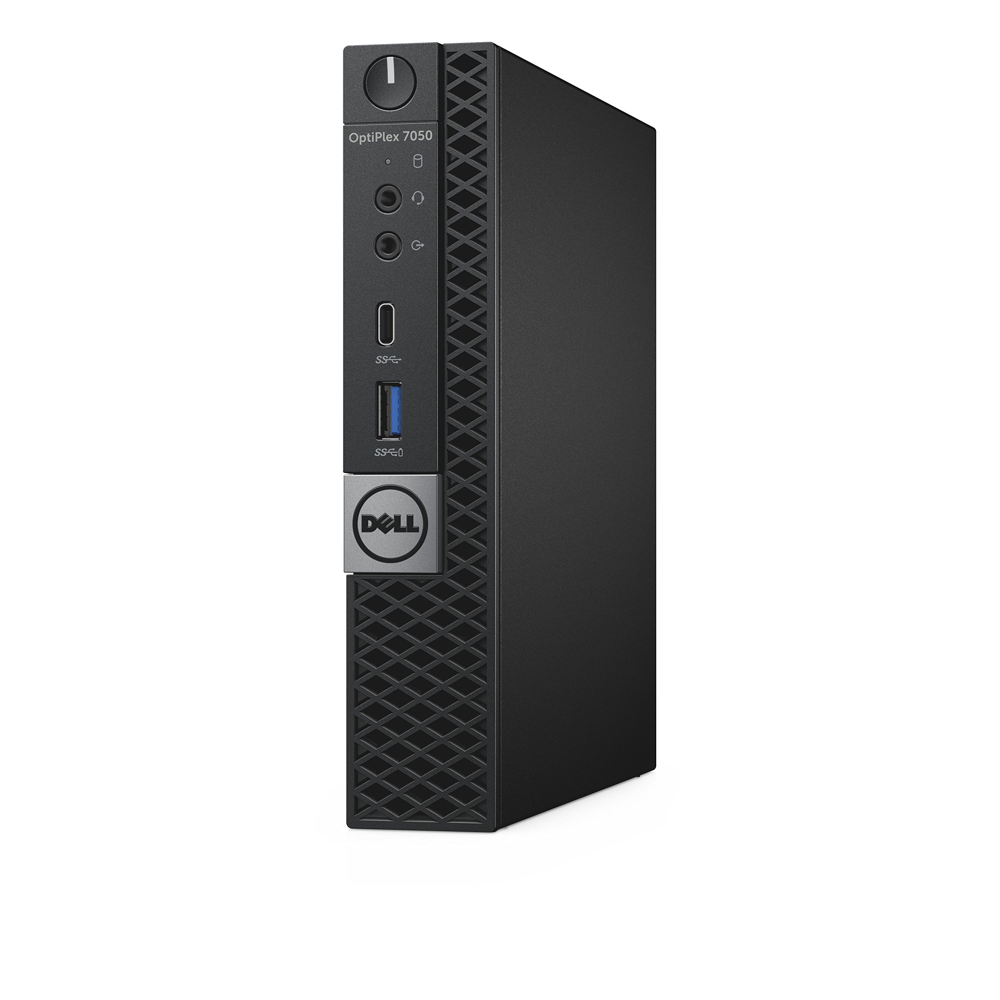

# Management Hypervisor

## Purpose

The management hypervisor hosts **infrastructure-critical services** for the substrate. This is Proxmox Node 1 in the two-hypervisor architecture, dedicated to management-plane workloads that must remain stable and available to support recovery operations.

---

## Hardware

| Substrate | Hardware | Notes |
|-----------|----------|-------|
| **dvntm** | 32GB RAM, 1TB storage | Portable mini PC or NUC-style |
| **dvnt** | Dell Optiplex 7050 MFF | Repurposed enterprise desktop |

### Selection Rationale

| Attribute | Requirement | Rationale |
|-----------|-------------|-----------|
| **RAM** | 32GB minimum | Multiple management VMs |
| **Storage** | 1TB SSD | VM images, local storage |
| **CPU** | Modern x86_64 with VT-x | Virtualization support |
| **NICs** | Gigabit Ethernet | Substrate network connectivity |

---

## Operating System

| Attribute | Value |
|-----------|-------|
| **OS** | Proxmox VE |
| **Version** | PVE 8.4.1 |
| **Base** | Debian 12 (Bookworm) |

### Automation Capability

- **Installation**: Manual ISO install (no PXE support for Proxmox)
- **Post-install**: Ansible configuration via `deevnet.builder` collection
- **VM provisioning**: Ansible-only (no Terraform for management plane)
- **Templates**: Packer-built Fedora templates stored locally

Proxmox is treated as an API surface for management workloads, not a declarative state engine.

---

## Dell Optiplex 7050 MFF

**Substrate**: dvnt (home)

The Dell Optiplex 7050 Micro Form Factor is a repurposed enterprise desktop used as the management hypervisor for the home substrate. Its compact size, low power consumption, and Intel virtualization support make it well-suited for always-on infrastructure workloads.



### Hardware

| Attribute | Value |
|-----------|-------|
| **Model** | Dell Optiplex 7050 Micro Form Factor |
| **CPU** | Intel i7-6700T (4-core/8-thread, 2.8-3.6GHz, 35W TDP) |
| **Memory** | 32GB DDR4 |
| **Storage** | 1TB NVMe/SATA SSD |
| **Ethernet** | 1x Gigabit (Intel I219-LM) |
| **Form factor** | Micro Form Factor (MFF) |
| **Power** | ~35W TDP |

### Selection Rationale

- **Repurposed enterprise desktop** - reliable, well-supported hardware
- **32GB RAM** meets management hypervisor requirements for multiple VMs
- **Compact form factor** suitable for home lab placement
- **Low power consumption** for always-on operation
- **Intel VT-x/VT-d** for Proxmox virtualization support
- **Intel I219-LM NIC** for reliable network connectivity

---

## Roles

The management hypervisor hosts these workload categories:

| Category | Examples |
|----------|----------|
| **Observability** | Metrics collection, log aggregation, alerting |
| **Automation & CI** | Ansible runners, image factory helpers |
| **Access & recovery** | Jump hosts, OOB tooling |

> **Note**: Core network services (DNS, DHCP, NAT) run on the [Core Router](/docs/platforms/network/core-router/), not as VMs on the management hypervisor.

---

## VM Templates

| Template | Description |
|----------|-------------|
| **Fedora** | Ansible-ready base image built via deevnet-image-factory |

Templates are built using Packer and stored locally on each hypervisor. New VMs clone from templates for rapid, consistent deployment.

---

## Deterministic MAC Addressing

For management-plane VMs, network identity must be stable and reproducible.

### Policy

- Proxmox does **not** generate deterministic MAC addresses automatically
- All management-plane VMs explicitly define MAC addresses
- MACs are generated **outside Proxmox** and stored in inventory/code
- DHCP and DNS rely on these fixed MACs

This enables:
- Stable DHCP reservations
- Predictable IP addressing
- Safe VM rebuilds without network reconfiguration
- Clear mapping between hostnames, MACs, and roles

---

## Non-Clustered Design

The management hypervisor operates **independently** without Proxmox clustering:

| Aspect | Implication |
|--------|-------------|
| **No HA failover** | VMs do not automatically migrate |
| **No shared storage** | Local storage only |
| **Independent management** | Dedicated web UI |
| **Simpler operations** | No quorum concerns |

### Rationale

For a two-node lab environment:
- Clustering adds complexity without meaningful HA
- Two-node clusters introduce quorum challenges
- Local storage is simpler and faster
- Manual VM placement is acceptable at this scale

---

## Provisioning Workflow

1. **Manual Proxmox install**: ISO boot, installer wizard
2. **Ansible post-config**: Apply `deevnet.builder` roles
3. **Template import**: Upload Packer-built templates
4. **VM creation**: Clone from templates via Ansible

Management VMs are created using **Ansible only** — simplicity and recoverability are prioritized over drift detection.

---

## Network Position

```
┌─────────────────┐      ┌────────────────────┐      ┌─────────────────────┐
│  Core Router    │◄────►│ Management         │◄────►│  Management VMs     │
│                 │      │ Hypervisor         │      │  (observability,    │
│                 │      │ (Proxmox Node 1)   │      │   automation, etc)  │
└─────────────────┘      └────────────────────┘      └─────────────────────┘
```

Guest VMs receive network configuration from Core Router DHCP, using static mappings for known management-plane hosts.

---

## Separation from Tenant Compute

The management hypervisor is intentionally separate from tenant workloads:

| Aspect | Management Hypervisor | Tenant Hypervisor |
|--------|----------------------|-------------------|
| **Workloads** | Infrastructure-critical | Experiments, apps |
| **Change cadence** | Slow, deliberate | Fast, experimental |
| **Rebuild tolerance** | Low | High |
| **MAC policy** | Deterministic | TBD |
| **Provisioning** | Ansible | Terraform (future) |

This separation reduces blast radius and ensures that tenant experimentation cannot impact platform stability.
