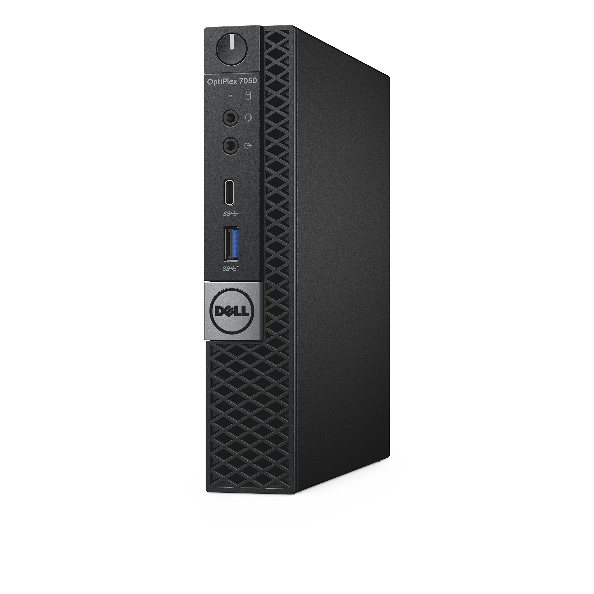

# Dell OptiPlex 7050 Micro

A repurposed enterprise desktop in Dell's Micro form factor, used as the management hypervisor. It is
small, low-power, and has Intel virtualization support, which suits always-on infrastructure work.
The tenant hypervisor is its successor, the [OptiPlex 7060 Micro](../dell-optiplex-7060-mff/).

## Specs

| Attribute | Value |
|-----------|-------|
| **Model** | Dell OptiPlex 7050 Micro Form Factor |
| **CPU** | Intel i7-6700T (4-core/8-thread, 2.8-3.6GHz, 35W TDP) |
| **Memory** | 32GB DDR4 (2x 16GB) |
| **Storage** | 512GB M.2 SATA SSD (OS) and 2TB SATA SSD (VM data) |
| **Ethernet** | 1x Gigabit (Intel I219-LM) |
| **Form factor** | Micro Form Factor (MFF) |
| **Power** | ~35W TDP |

## Selection Rationale

- **Repurposed enterprise desktop** - reliable, well-supported hardware
- **32GB RAM** meets management hypervisor requirements for multiple VMs
- **Compact form factor** suitable for mobile lab placement
- **Low power consumption** for always-on operation
- **Intel VT-x/VT-d** for Proxmox virtualization support
- **Intel I219-LM NIC** for reliable network connectivity

## In Service

| Host | Role |
|---|---|
| `dv02hyp001p01` | [Management Hypervisor](/docs/platforms/management-plane/management-hypervisor/) |

## Physical

| NIC | Connects to |
|---|---|
| `enp0s31f6` | Switch `gi1/0/15`, trunk, native VLAN 99, VLANs 25 and 35 tagged |

- **Single NIC:** there is no second port, so every VM segment rides this one trunk.
- **Wake-on-LAN:** enabled.
- **Console:** a DisplayPort-to-HDMI adapter and a USB keyboard; see
  [Hypervisor console recovery](/docs/runbook/substrate/recovery/console-recovery/hypervisor/).

## Firmware

The BIOS version is in the
[Software Catalog](/docs/platforms/software-catalog/#management-hypervisor-dv02hyp001p01).

## Certification

| | |
|---|---|
| **Role** | Management hypervisor |
| **Current** |  In service from before the [Certification](/docs/policies/lifecycle-management/certification/) policy |

### Revisions

None yet.
