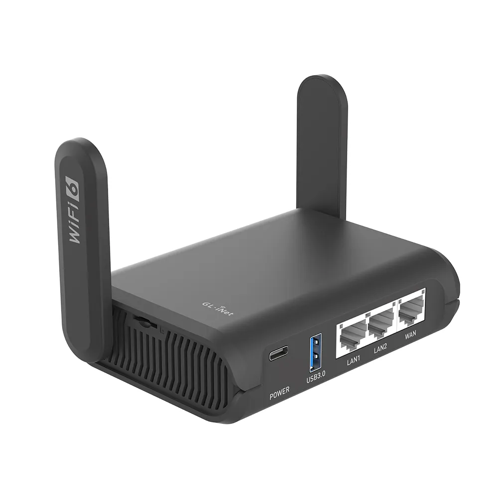

# GL-iNet GL-AXT1800 Slate AX

A portable Wi-Fi 6 travel router, used as the mobile site's edge router. It connects the site to
whatever upstream is available: hotel Wi-Fi, a tethered phone, or a wired uplink.

## Specs

| Attribute | Value |
|-----------|-------|
| **Model** | GL-iNet GL-AXT1800 (Slate AX) |
| **CPU** | IPQ6000 1.2GHz quad-core |
| **Memory** | 512MB DDR3L |
| **Storage** | 128MB NAND Flash |
| **Ethernet** | 3x Gigabit (1 WAN, 2 LAN) |
| **Wi-Fi** | Wi-Fi 6 (802.11ax) dual-band, 1800Mbps |
| **USB** | USB 3.0 |
| **Power** | USB-C, <8.75W max |
| **Dimensions** | 125 x 82 x 36mm |
| **Weight** | 245g |

## Selection Rationale

- **Portability**: Compact form factor with retractable antennas fits in a laptop bag
- **Flexible upstream**: Can connect via Ethernet, Wi-Fi repeater, or USB tethering
- **OpenWrt-based**: Runs standard OpenWrt with full package ecosystem
- **VPN capable**: WireGuard and OpenVPN at near-gigabit speeds
- **Power efficient**: Runs from USB-C power bank if needed

## In Service

| Host | Role |
|---|---|
| `dv02edg001p01` | [Edge Router](/docs/platforms/network/edge-router/). Unmanaged: not configured by automation |

## Physical

| Port | Connects to |
|---|---|
| WAN | Wired upstream, when there is one. Otherwise the upstream is Wi-Fi, in repeater mode |
| LAN | The core router's WAN port (`re1`) |
| LAN | The Builder's upstream NIC (`enp1s0`), directly rather than through the switch |

Which LAN port each device uses is not recorded.

- **Power:** USB-C. It stays powered when the site is shut down.
- **Console:** none documented. It is reached through its web UI on its LAN side; see
  [Operator Access](/docs/runbook/substrate/network/operator-access/).

## Firmware

GL.iNet firmware, an OpenWrt fork. The version is not recorded; see the
[Software Catalog](/docs/platforms/software-catalog/#switching-wireless-and-edge).

## Evaluation

| | |
|---|---|
| **Role** | Edge router |
| **Current** |  In service from before the [Evaluation](/docs/policies/lifecycle-management/evaluation/) policy |

### Revisions

None yet.
