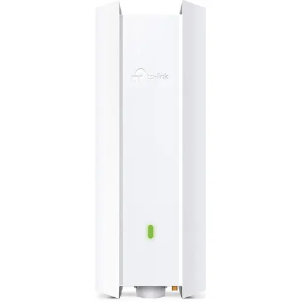

# TP-Link Omada EAP650-Outdoor

A Wi-Fi 6 outdoor access point from TP-Link's Omada line, used as the mobile site's access point.
It is outdoor-rated, and its rugged build suits the mobile site's varied deployments.

## Specs

| Attribute | Value |
|-----------|-------|
| **Model** | TP-Link Omada EAP650-Outdoor, hardware v1.0 (US) |
| **Wi-Fi Standard** | Wi-Fi 6 (802.11ax) |
| **Bands** | Dual-band (2.4GHz + 5GHz) |
| **Speed** | AX3000 (574 + 2402 Mbps) |
| **Antennas** | 2x2 internal (2.4GHz), 2x2 internal (5GHz) |
| **Ethernet** | 1x Gigabit RJ45 |
| **Power** | 802.3at PoE (12.3W typical) |
| **Weatherproofing** | IP67 |
| **Operating Temp** | -30°C to 70°C |
| **Mounting** | Wall/pole mount |

## Selection Rationale

- **VLAN capable**: Supports VLAN tagging per SSID for network segmentation
- **API manageable**: Omada controller provides REST API for automation
- **Wi-Fi 6**: Modern standard with improved efficiency and capacity
- **Rugged**: IP67 rating handles varied mobile deployment conditions
- **Omada ecosystem**: Matches the SG2218 switch for unified management
- **PoE powered**: Single cable for power and data

## In Service

| Host | Role |
|---|---|
| `dv02wap001p01` | [Wireless Access Point](/docs/platforms/network/access-point/) |

## Physical

- **Network:** its one port goes to switch `gi1/0/4`, a trunk with native VLAN 99 and VLANs 10,
  30, 31, 40 and 45 tagged.
- **Power:** PoE from the injector supplied with the AP, since the switch has no PoE. A stalled boot
  has been cleared by power-cycling the injector.
- **Console:** there is none. Recovery is a wired laptop on `gi1/0/2` and the reset button, which
  needs a proper tool rather than a paperclip; see
  [Wireless AP console recovery](/docs/runbook/substrate/recovery/console-recovery/wireless-ap/).

## Firmware

Hardware v1.0 (US). TP-Link's firmware file labeled V1.6 is the right one for this unit. The running
version is in the
[Software Catalog](/docs/platforms/software-catalog/#switching-wireless-and-edge).

## Evaluation

| | |
|---|---|
| **Role** | Wireless access point |
| **Current** |  In service from before the [Evaluation](/docs/policies/lifecycle-management/evaluation/) policy |

### Revisions

None yet.
