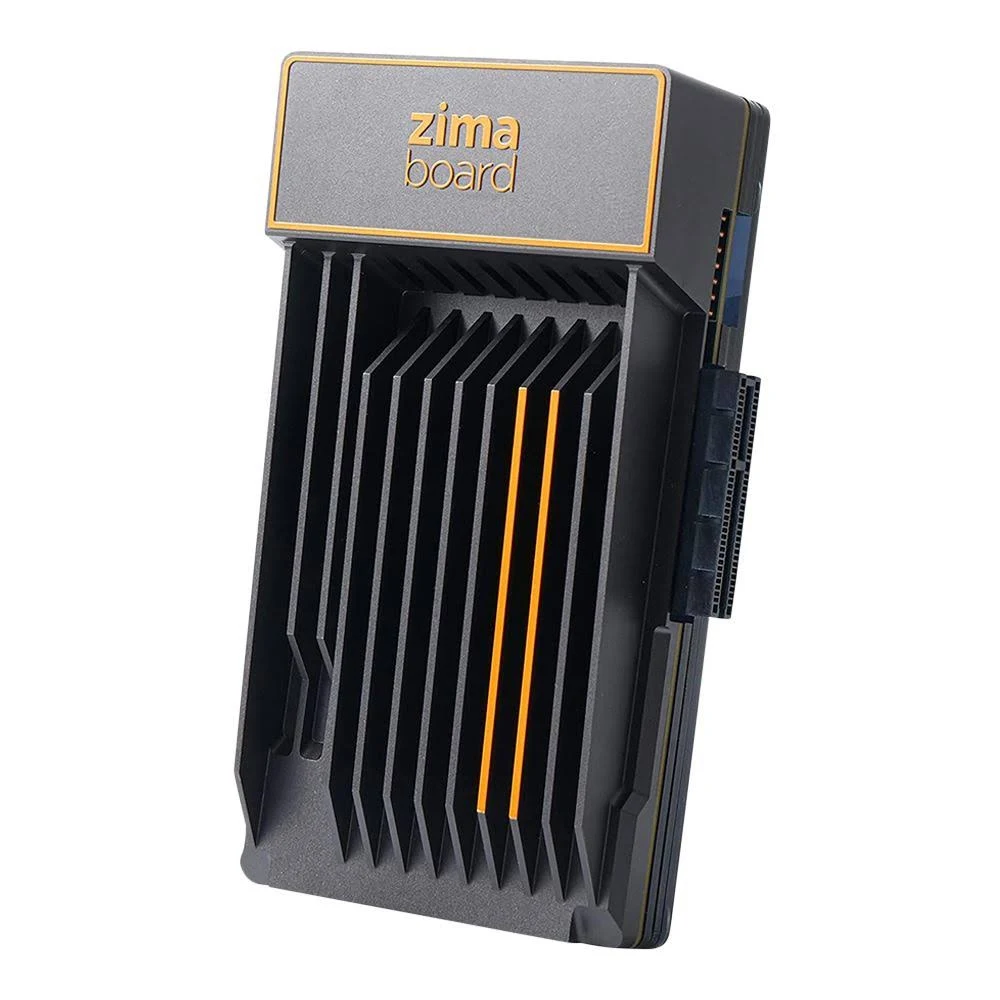

# ZimaBoard 832

A compact x86 single-board server, used as the mobile site's core router. Low power and passive
cooling suit a portable site.

## Specs

| Attribute | Value |
|-----------|-------|
| **Model** | ZimaBoard 832 |
| **CPU** | Intel Celeron N3450 quad-core (1.1-2.2GHz) |
| **Memory** | 8GB LPDDR4 |
| **Storage** | 32GB eMMC |
| **Ethernet** | 2x Gigabit LAN (Realtek RTL8168/8111) |
| **Expansion** | PCIe x4, 2x SATA 6.0 Gb/s |
| **USB** | 2x USB 3.0 |
| **Video** | Mini DisplayPort (4K/60Hz) |
| **Power** | 6W TDP, 12V DC barrel jack |
| **Cooling** | Passive (aluminum case heatsink) |

## Selection Rationale

- **Compact x86 form factor** fits mobile site
- **Dual Gigabit Ethernet** for WAN/LAN separation
- **Low power consumption** (<6W TDP) suitable for always-on operation
- **Passive cooling** (fanless, silent) for noise-sensitive environments
- **x86 architecture** supports OPNsense natively

{}
**The Realtek NICs are an open problem.** The LAN NIC, `re0`, has recurring watchdog timeouts on
FreeBSD's `re(4)` driver: [INC-0004](/docs/incidents/2026/0004-core-router-lost/). A replacement
with non-Realtek NICs is being considered: the
[N100 router appliance](/docs/platforms/evaluations/hardware/n100-router-appliance/).
{}

## In Service

| Host | Role |
|---|---|
| `dv02cor002p01` | [Core Router](/docs/platforms/network/core-router/) |

## Physical

| NIC | Use | Connects to |
|---|---|---|
| `re0` | LAN. Every VLAN is built on it | Switch `gi1/0/1`, trunk, native VLAN 999, all VLANs tagged |
| `re1` | WAN | The [edge router](../gl-inet-slate-ax/)'s LAN, by DHCP |

- **Power:** 12V DC barrel jack.
- **Console:** Mini DisplayPort to a monitor, plus a USB keyboard. It has no VGA or HDMI; see
  [Core Router console recovery](/docs/runbook/substrate/recovery/console-recovery/core-router/).

## Firmware

The BIOS version is not recorded. OPNsense is in the
[Software Catalog](/docs/platforms/software-catalog/#core-router-opnsense-dv02cor002p01).

## Evaluation

| | |
|---|---|
| **Role** | Core router |
| **Current** |  In service from before the [Evaluation](/docs/policies/lifecycle-management/evaluation/) policy |

### Revisions

None yet.
