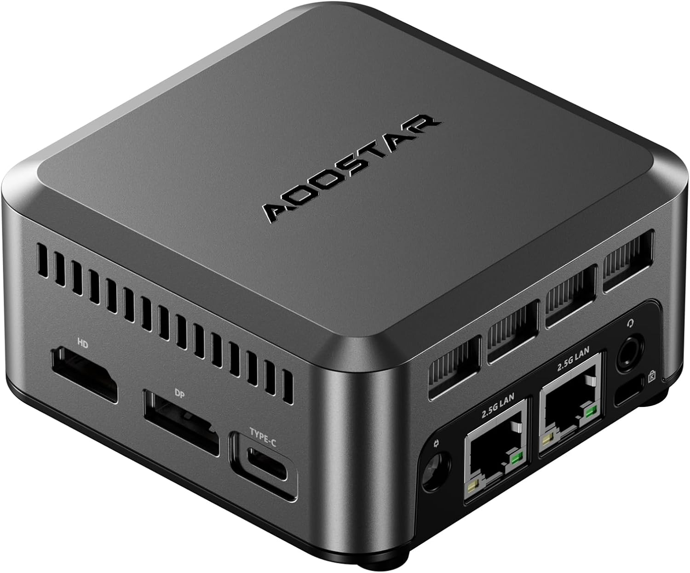

# Bootstrap Node

## Purpose

The bootstrap node is the **management plane** for standing up a Deevnet site. It's a single, portable device that contains everything needed to provision and configure an entire environment from scratch.

Goals:
- **Self-contained** — All automation, artifacts, and services on one device
- **Portable** — Move between sites (dvntm, dvnt) as needed
- **Out-of-band** — Can operate independently of the site network
- **Air-gapped capable** — Can provision without upstream internet once artifacts are staged
- **Disposable authority** — Hands off control to Core Router once the site is running

"Bring one box, provision everything."

---

## Hardware Platforms

{}

{}

**Site**: dvntm (mobile)

The mobile site uses a portable developer workstation (laptop) as its bootstrap node. Dual-NIC capability is achieved via built-in Ethernet or USB adapter.

### Hardware

| Attribute | Value |
|-----------|-------|
| **Type** | Developer workstation (laptop) |
| **NICs** | Dual-NIC (built-in + USB adapter) |
| **Storage** | 500GB+ |
| **RAM** | 16GB+ |
| **CPU** | Modern x86_64 |

### Selection Rationale

- **Portability**: Already carried for development work
- **Dual-NIC capable**: Upstream + substrate connectivity
- **Sufficient resources**: Meets bootstrap node requirements
- **Dual-purpose**: Serves as both workstation and bootstrap node

{}

{}

**Site**: dvnt (home)

The AOOSTAR N1 PRO is a compact mini PC used as the dedicated bootstrap node for the home site. Its dual 2.5GbE NICs provide the upstream + substrate connectivity required for the bootstrap role.



### Hardware

| Attribute | Value |
|-----------|-------|
| **Model** | AOOSTAR N1 PRO |
| **CPU** | Intel N150 (upgraded N100 variant) |
| **Memory** | 12GB LPDDR5 |
| **Storage** | 1TB NVMe SSD |
| **Ethernet** | 2x 2.5GbE (Intel i226-V) |
| **Form factor** | Mini PC |
| **Cooling** | Active (fan) |

### Selection Rationale

- **Dual 2.5GbE NICs** for upstream + substrate connectivity (bootstrap requirement)
- **Compact form factor** for dedicated always-on bootstrap role
- **12GB RAM** sufficient for artifact serving and Ansible execution
- **1TB storage** for ISOs, images, and boot artifacts
- **Intel i226-V NICs** for reliable network performance

{}

{}

---

## Operating System

Both bootstrap nodes run Fedora Workstation, configured via the `deevnet.builder` Ansible collection.

| Attribute | Value |
|-----------|-------|
| **OS** | Fedora Workstation |
| **Version** | Fedora 43+ |
| **Collection** | `deevnet.builder` applied |

The bootstrap node is provisioned via PXE from another bootstrap node, or manually installed and then configured via Ansible self-application.

---

## Network Position


graph LR
    A[Host Network<br>WAN/upstream] <--> B[Bootstrap Node<br>dual-homed] <--> C[Site Network<br>dvntm/dvnt]


- **Upstream interface**: Connects to existing network (home, hotel, office) for internet access
- **Downstream interface**: Becomes the gateway for the site during bootstrap

{}
During initial provisioning, the bootstrap node may NAT traffic for substrate hosts. Once Core Router is configured, routing authority transitions. This handoff is **explicit, not automatic**.
{}

---

## Roles

The bootstrap node is configured using these `deevnet.builder` roles:

| Role | Purpose |
|------|---------|
| **[Workstation](workstation-role/)** | Developer tools, users, Ansible controller |
| **[Artifacts](artifacts-role/)** | Air-gapped artifact serving (ISOs, packages, images) |
| **[PXE](pxe-role/)** | Network boot infrastructure (TFTP, GRUB configs) |
| **[Network Controller](network-controller-role/)** | Switch and AP management (Omada/UniFi) |

---

## Service Identity

Per the [Naming Standard](/docs/standards/naming/):

- `bootstrap.dvntm.deevnet.net` — The bootstrap node itself
- `artifacts.dvntm.deevnet.net` → `bootstrap.dvntm.deevnet.net` (CNAME)
- `pxe.dvntm.deevnet.net` → `bootstrap.dvntm.deevnet.net` (CNAME)

Per [Multihoming](/docs/standards/correctness/#33-multihoming-service-co-location), the bootstrap node hosts multiple services. This co-location is intentional and documented—blast radius is understood.

---

## Git Repository Layout

All Deevnet repositories are checked out to a standard location:

```
~/dvnt/
├── ansible-collection-deevnet.builder/   # Provisioning roles
├── ansible-collection-deevnet.net/       # Network device configuration
├── ansible-inventory-deevnet/            # Host inventory (dvnt, dvntm)
├── deevnet-image-factory/                # Packer image builds
└── deevnet-docs/                         # This documentation (submodule)
```

The inventory is site-specific. Running playbooks from the bootstrap node targets the connected site.
