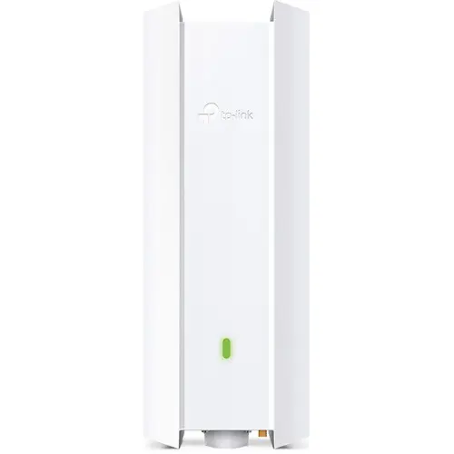

# Wireless Access Point

## Purpose

The access point provides **wireless connectivity** for mobile devices, laptops, and IoT devices within the site.


graph LR
    A[Access Switch VLAN trunk] <--> B[Access Point Wi-Fi] <--> C[Wireless Clients]


---

## Hardware Platform

**Site**: mobile (mobile)

The EAP650-Outdoor is a Wi-Fi 6 outdoor access point from TP-Link's Omada SDN product line. Despite being outdoor-rated, its rugged design makes it suitable for the mobile site's varied deployment environments.

### Hardware

| Attribute | Value |
|-----------|-------|
| **Model** | TP-Link Omada EAP650-Outdoor |
| **Wi-Fi Standard** | Wi-Fi 6 (802.11ax) |
| **Bands** | Dual-band (2.4GHz + 5GHz) |
| **Speed** | AX3000 (574 + 2402 Mbps) |
| **Antennas** | 2x2 internal (2.4GHz), 2x2 internal (5GHz) |
| **Ethernet** | 1x Gigabit RJ45 |
| **Power** | 802.3at PoE (12.3W typical), from the injector supplied with the AP — the SG2218 has no PoE |
| **Weatherproofing** | IP67 |
| **Operating Temp** | -30°C to 70°C |
| **Mounting** | Wall/pole mount |

### Selection Rationale

- **VLAN capable**: Supports VLAN tagging per SSID for network segmentation
- **API manageable**: Omada controller provides REST API for automation
- **Wi-Fi 6**: Modern standard with improved efficiency and capacity
- **Rugged**: IP67 rating handles varied mobile deployment conditions
- **Omada ecosystem**: Matches mobile switch (SG2218) for unified management
- **PoE powered**: Single cable for power and data

### Management

| Attribute | Value |
|-----------|-------|
| **Controller** | TP-Link Omada SDN |
| **VLAN Support** | Yes — per-SSID VLAN tagging |
| **API** | Yes — Omada controller REST API |
| **Automation** | `deevnet.net` Ansible collection (Omada API) |

### Roles

| Role | Description |
|------|-------------|
| **Wireless access** | Provides Wi-Fi 6 connectivity for clients |
| **SSID-to-VLAN mapping** | Multiple SSIDs mapped to VLANs |
| **Band steering** | Directs capable clients to 5GHz |

---

## VLAN and API Capability Summary

The EAP650-Outdoor meets the core selection criteria:

| Requirement | EAP650-Outdoor |
|-------------|----------------|
| **VLAN tagging** | ✓ Per-SSID |
| **API management** | ✓ Omada REST API |
| **Controller-managed** | ✓ Omada SDN |
| **PoE powered** | ✓ 802.3at |

---

## Configuration Management

| Controller | Automation |
|------------|------------|
| Omada SDN | `deevnet.net` Ansible collection (Omada API) |

### SSID Design

One SSID per trust class, each carrying one VLAN. The names come from `wifi_ssid` in
`deevnet_vlans`, and the controller applies them — inventory is the only declaration
([ADR-0009](/docs/architecture/decisions/0009-network-device-config-ownership/)).

| SSID | VLAN | Security | Key |
|---|---|---|---|
| `DVNTM` | 10 (trusted) | WPA-Personal | one shared key, from the vault |
| `DVNTM-IOT` | 30 (IoT) | **PPSK** (`security: 4`) | **one key per tenant**, issued by the Deevnet API |
| `DVNTM-IOTV` | 31 (IoT Vendor) | WPA-Personal | one shared key, from the vault |
| `DVNTM-GUEST` | 40 (guest) | WPA-Personal + guest isolation | one shared key, from the vault |
| `DVNTM-TD` | 45 (tenant dev) | WPA-Personal | one shared key, from the vault. No client isolation between laptops ([CHG-0022](/docs/changes/2026/0022-tenant-dev-network/)) |

**No SSID carries the management segment.** The operator reaches management from `DVNTM`,
through the zone policy's declared `trusted -> management` exception. That makes the trusted
Wi-Fi the everyday administration path
([Operator Access](/docs/runbook/substrate/network/operator-access/)). Strictly, a dedicated jump
host would be the more correct design: one audited entry point instead of a whole segment allowed
in. For a lab this size it isn't built. Every other SSID is refused at management, which
[Segment Check](/docs/runbook/substrate/network/segment-check/) verifies from a client.

**On `DVNTM-IOT` the key decides the VLAN.** It is a PPSK SSID, so each key in its profile carries
its own VLAN binding, and a device lands on the VLAN of the key it was flashed with — proven on this
AP at firmware 1.3.11 in
[CHG-0005](/docs/changes/2026/0005-wireless-ap-firmware-and-adoption/) phase 6. A per-key VLAN needs
no controller network object: it is raw 802.1Q tagging, and the core router serves the DHCP.

**Who owns what** ([ADR-0012](/docs/architecture/decisions/0012-iot-platform-api/) §6):

- **Inventory owns** the SSID and the PPSK profile. `omada-wireless.yml` creates them and never
  rewrites or deletes what it finds.
- **The Deevnet API owns the keys inside the profile**, one per tenant per trust class. A tenant gets
  one from `terraform apply` and never touches the controller.
- The automation therefore does **not** report those keys as drift. It names the profiles whose
  contents it is deliberately not inspecting, because reading them would pull every tenant's password
  into Ansible's memory and output.

**One entry you may see and should leave alone.** The controller refuses to let a PPSK profile reach
zero keys (`errorCode -34044`), although it will happily create one empty. So when the last tenant key
in a profile is revoked, the API leaves one placeholder named `DEEVNET-PLACEHOLDER-DO-NOT-USE`. Its
password is generated, returned to nobody and stored nowhere, so it cannot be used to join anything,
and it disappears the moment any real key is issued. It is only ever present when the alternative
would be an empty profile.

Changing any of this is `make wireless` in `deevnet.net`, never the controller UI.
