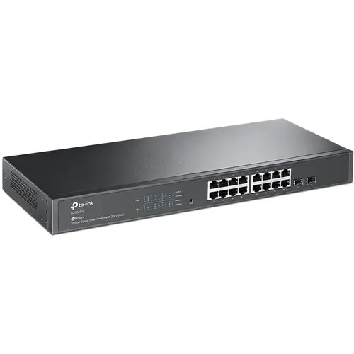

# Access Switch

## Purpose

The access switch provides **Layer 2 connectivity** for substrate hosts, connecting endpoints to the core router. Access switches handle VLAN tagging, port isolation, and traffic aggregation.


graph LR
    A[Core Router] <--> B[Access Switch] <--> C[Site Hosts]


---

## Hardware Platform

**Site**: mobile (mobile)

The SG2218 is a managed Gigabit switch from TP-Link's Omada SDN product line. It provides VLAN support and can be configured via SSH or the Omada controller.

### Hardware

| Attribute | Value |
|-----------|-------|
| **Model** | TP-Link Omada SG2218 |
| **Ports** | 16x Gigabit RJ45 |
| **Uplinks** | 2x SFP (1Gbps) |
| **PoE** | None — the AP runs from its own injector |
| **Switching Capacity** | 36 Gbps |
| **MAC Table** | 8K entries |
| **Jumbo Frames** | 9216 bytes |
| **Power** | 8.65W max |
| **Dimensions** | 294 x 180 x 44mm |
| **Mounting** | Desktop or rack (1U) |

### Selection Rationale

- **VLAN support**: 802.1Q VLAN tagging for network segmentation
- **SSH access**: CLI configuration for automation
- **Omada SDN**: Centralized management via Omada controller
- **Compact**: Fits mobile site form factor
- **SFP uplinks**: Future 1G fiber connectivity option
- **Fanless**: Silent operation (passive cooling)

### Management

| Attribute | Value |
|-----------|-------|
| **Controller** | TP-Link Omada SDN |
| **CLI** | SSH access |
| **Web UI** | Standalone or controller-managed |
| **Automation** | Omada API via `deevnet.net` collection |

### Roles

| Role | Description |
|------|-------------|
| **L2 switching** | Connects substrate hosts to core router |
| **VLAN tagging** | 802.1Q trunk to core router |
| **Port isolation** | Separates trust zones at L2 |

---

## Configuration Management

| Controller | Automation |
|------------|------------|
| None: standalone, not yet adopted into Omada ([CHG-0009](/docs/changes/2026/0009-access-switch-adoption/), on hold) | `deevnet.net` `switch_vlans` over SSH CLI |

### VLAN Configuration

VLANs are defined in the substrate standards and configured on all access switches:

| VLAN | Purpose |
|------|---------|
| Management | Infrastructure management traffic |
| Tenant | Application/user traffic |
| IoT | Isolated IoT devices |

Specific VLAN IDs are documented in the [Network Segmentation](/docs/standards/network-segmentation/) standard.
