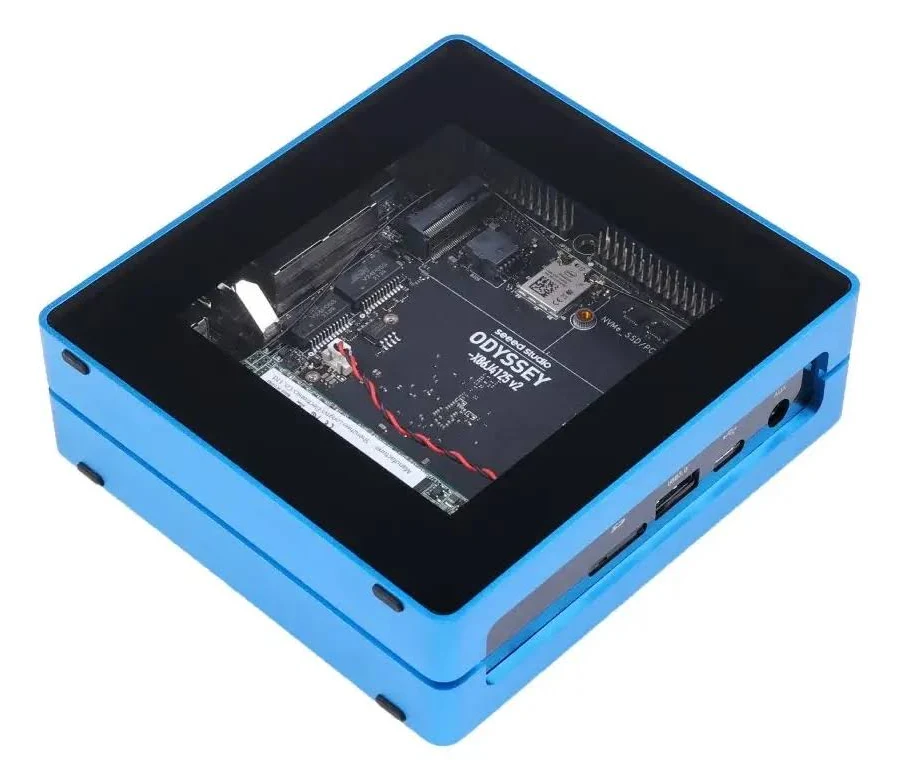

# Core Router

## Purpose

The core router is the **production network authority** for each Deevnet substrate. It provides routing, firewall, DNS, DHCP, and gateway services for all substrate hosts.

```
┌─────────────────┐      ┌──────────────────┐      ┌─────────────────────┐
│   Edge Router   │◄────►│   Core Router    │◄────►│  Substrate Hosts    │
│   (unmanaged)   │      │   (managed)      │      │                     │
└─────────────────┘      └──────────────────┘      └─────────────────────┘
```

| Substrate | Upstream Connection |
|-----------|---------------------|
| **dvntm** | Travel router (portable WAN) |
| **dvnt** | ISP router (home internet) |

---

## ZimaBoard 832

**Substrate**: dvntm (mobile)

The ZimaBoard 832 is a compact x86 single-board server used as the core router for the mobile substrate. Its low power consumption and passive cooling make it ideal for portable deployments.


### Hardware

| Attribute | Value |
|-----------|-------|
| **Model** | ZimaBoard 832 |
| **CPU** | Intel Celeron N3450 quad-core (1.1-2.2GHz) |
| **Memory** | 8GB LPDDR4 |
| **Storage** | 32GB eMMC |
| **Ethernet** | 2x Gigabit LAN |
| **Expansion** | PCIe x4, 2x SATA 6.0 Gb/s |
| **USB** | 2x USB 3.0 |
| **Video** | Mini DisplayPort (4K/60Hz) |
| **Power** | 6W TDP, 12V DC barrel jack |
| **Cooling** | Passive (aluminum case heatsink) |

### Selection Rationale

- **Compact x86 form factor** fits mobile substrate
- **Dual Gigabit Ethernet** for WAN/LAN separation
- **Low power consumption** (<6W TDP) suitable for always-on operation
- **Passive cooling** (fanless, silent) for noise-sensitive environments
- **x86 architecture** supports OPNsense natively

### Operating System

| Attribute | Value |
|-----------|-------|
| **OS** | OPNsense |
| **Version** | 24.x |
| **Base** | FreeBSD |

### Roles

| Role | Description |
|------|-------------|
| **DNS Forwarding** | Forwards DNS queries to upstream resolver |
| **DHCP** | Static mappings for known hosts, pool for dynamic clients |
| **NAT** | Masquerades substrate traffic to upstream |
| **Wake-on-LAN** | WoL proxy for substrate hosts |
| **Gateway** | Default route for all substrate traffic |

---

## Seeed Studio ODYSSEY X86J4125864

**Substrate**: dvnt (home)

The ODYSSEY X86J4125864 is an x86 single-board computer used as the core router for the home substrate. It provides more compute headroom and expansion options compared to the mobile router.



### Hardware

| Attribute | Value |
|-----------|-------|
| **Model** | ODYSSEY X86J4125864 |
| **CPU** | Intel Celeron J4125 quad-core (2.0-2.7GHz) |
| **Memory** | 8GB LPDDR4 |
| **Storage** | 64GB eMMC |
| **Ethernet** | 2x Gigabit LAN (Realtek) |
| **Expansion** | M.2 B-Key, M.2 M-Key, SATA III |
| **USB** | 4x USB (2x USB 3.0, 2x USB 2.0) |
| **Video** | HDMI 2.0a + DP 1.2a (4K/60Hz) |
| **Wireless** | Wi-Fi 802.11ac, Bluetooth 5.0 |
| **Power** | ~10-12W typical, 12V DC |
| **Cooling** | Active (included fan) |
| **Co-processor** | ATSAMD21 (Arduino compatible) |

### Selection Rationale

- **Dual Gigabit Ethernet** for WAN/LAN separation
- **x86 architecture** supports OPNsense natively
- **Sufficient compute** for home network routing
- **M.2 slots** for expansion (future 10GbE, NVMe)
- **eMMC storage** for reliable boot

### Operating System

| Attribute | Value |
|-----------|-------|
| **OS** | OPNsense |
| **Version** | 24.x |
| **Base** | FreeBSD |

### Roles

| Role | Description |
|------|-------------|
| **DNS Forwarding** | Forwards DNS queries to upstream resolver |
| **DHCP** | Static mappings for known hosts, pool for dynamic clients |
| **NAT** | Masquerades substrate traffic to upstream |
| **Wake-on-LAN** | WoL proxy for substrate hosts |
| **Gateway** | Default route for all substrate traffic |

---

## Configuration Management

Configured via the `deevnet.net` Ansible collection:

| Component | Management |
|-----------|------------|
| DNS records | Pushed from inventory |
| DHCP static mappings | Pushed from inventory |
| Firewall rules | Defined in playbooks |
| WoL targets | Defined in inventory |

---

## Authority Transition

Per the [Correctness Standard](/docs/standards/correctness/#52-authority-modes-are-explicit):

1. During initial provisioning, the bootstrap node provides DNS/DHCP
2. Core router is provisioned and configured via Ansible
3. Authority explicitly transitions to core router
4. Bootstrap node's dnsmasq is disabled
5. Core router becomes the production DNS/DHCP server

**This transition is explicit, not automatic.**
