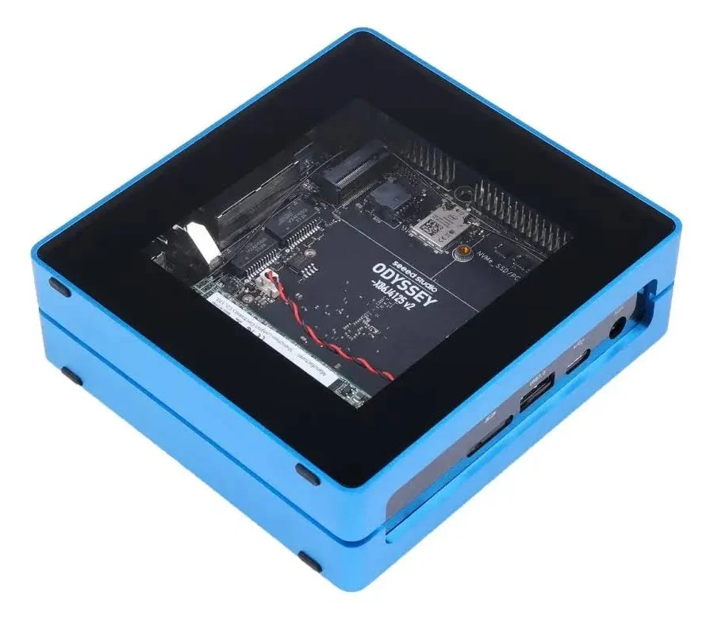

# Core Router

## Purpose

The core router is the **production network authority** for each Deevnet site. It provides routing, firewall, DNS, DHCP, and gateway services for all substrate hosts.


graph LR
    A[Edge Router<br>unmanaged] <--> B[Core Router<br>managed] <--> C[Site Hosts]


## Hardware Platforms

{}

{}

**Site**: mobile (mobile) 

The ZimaBoard 832 is a compact x86 single-board server used as the core router for the mobile site. Its low power consumption and passive cooling make it ideal for portable deployments.


### Hardware

| Attribute | Value |
|-----------|-------|
| **Model** | ZimaBoard 832 |
| **CPU** | Intel Celeron N3450 quad-core (1.1-2.2GHz) |
| **Memory** | 8GB LPDDR4 |
| **Storage** | 32GB eMMC |
| **Ethernet** | 2x Gigabit LAN |
| **Expansion** | PCIe x4, 2x SATA 6.0 Gb/s |
| **USB** | 2x USB 3.0 |
| **Video** | Mini DisplayPort (4K/60Hz) |
| **Power** | 6W TDP, 12V DC barrel jack |
| **Cooling** | Passive (aluminum case heatsink) |

### Selection Rationale

- **Compact x86 form factor** fits mobile site
- **Dual Gigabit Ethernet** for WAN/LAN separation
- **Low power consumption** (<6W TDP) suitable for always-on operation
- **Passive cooling** (fanless, silent) for noise-sensitive environments
- **x86 architecture** supports OPNsense natively

{}

{}

**Site**: home (home) 

The ODYSSEY X86J4125864 is an x86 single-board computer used as the core router for the home site. It provides more compute headroom and expansion options compared to the mobile router.



### Hardware

| Attribute | Value |
|-----------|-------|
| **Model** | ODYSSEY X86J4125864 |
| **CPU** | Intel Celeron J4125 quad-core (2.0-2.7GHz) |
| **Memory** | 8GB LPDDR4 |
| **Storage** | 64GB eMMC |
| **Ethernet** | 2x Gigabit LAN (Realtek) |
| **Expansion** | M.2 B-Key, M.2 M-Key, SATA III |
| **USB** | 4x USB (2x USB 3.0, 2x USB 2.0) |
| **Video** | HDMI 2.0a + DP 1.2a (4K/60Hz) |
| **Wireless** | Wi-Fi 802.11ac, Bluetooth 5.0 |
| **Power** | ~10-12W typical, 12V DC |
| **Cooling** | Active (included fan) |
| **Co-processor** | ATSAMD21 (Arduino compatible) |

### Selection Rationale

- **Dual Gigabit Ethernet** for WAN/LAN separation
- **x86 architecture** supports OPNsense natively
- **Sufficient compute** for home network routing
- **M.2 slots** for expansion (future 10GbE, NVMe)
- **eMMC storage** for reliable boot

{}

{}

---

## Operating System

Both core routers run OPNsense, providing a consistent firewall and routing platform across sites.

| Attribute | Value |
|-----------|-------|
| **OS** | OPNsense |
| **Version** | 24.x |
| **Base** | FreeBSD |

---

## Roles

| Role | Description |
|------|-------------|
| **DNS Forwarding** | Forwards DNS queries to upstream resolver |
| **DHCP** | Static mappings for known hosts, pool for dynamic clients |
| **NAT** | Masquerades substrate traffic to upstream |
| **Wake-on-LAN** | WoL proxy for substrate hosts |
| **Gateway** | Default route for all substrate traffic |

---

## Configuration Management

Configured via the `deevnet.net` Ansible collection:

| Component | Management |
|-----------|------------|
| DNS records | Pushed from inventory |
| DHCP static mappings | Pushed from inventory |
| Firewall rules | Defined in playbooks |
| WoL targets | Defined in inventory |

### DNS: Unbound

Three distinct collections, reconciled from inventory by the `opnsense_dns` role:

| What | OPNsense feature | Used for |
|------|------------------|----------|
| Address records | Host override | `host.mobile.deevnet.net` → address |
| Aliases | Host alias | Service names pointing at a host — stored as CNAMEs |
| Zone forwards | Query Forwarding | Sending a tenant zone to the tenant authoritative service |

**The API shape for Query Forwarding is not where you would look for it, verified on 25.7.10.**
These rows are *not* part of `unbound/settings/get` — that payload's keys are `general`, `advanced`,
`acls`, `dnsbl`, `forwarding`, `dots`, `hosts`, `aliases`, and `forwarding` is the *use system
nameservers* toggle rather than a collection. Forward rows have their own endpoints and are wrapped
in a `dot` object that backs both DNS-over-TLS and plain rows:

```
POST /api/unbound/settings/searchForward
POST /api/unbound/settings/addForward
POST /api/unbound/settings/setForward/<uuid>
POST /api/unbound/settings/delForward/<uuid>

body: {"dot": {"enabled": "1", "type": "forward",
               "domain": "...", "server": "...", "description": "..."}}
```

`type` must be `forward`. The default would attempt DNS-over-TLS against an authoritative server on
port 53.

Changes land in the saved configuration only; the running resolver is not updated until
`POST /api/unbound/service/reconfigure`.

Because these are forwards rather than referrals, the resolver never consults the tenant zone's own
apex records — see
[Naming and Addressing](/docs/architecture/substrate/naming-and-addressing/) for what that changes.

### DHCP: Kea

Reservations are generated from inventory and keyed on each host's declared hardware address, which
makes the MAC load-bearing: a guest whose NIC does not carry its declared address does not match its
reservation and silently receives a pool address instead. On the management segment the pool begins
at `.200`, so that failure shows up as a host sitting somewhere in the `.200+` range with no name
pointing at it.

The platform segment has reservations only and no pool at all.

---

## Authority Transition

Per the [Correctness Standard](/docs/standards/correctness/#52-authority-modes-are-explicit):

1. During initial provisioning, the bootstrap node provides DNS/DHCP
2. Core router is provisioned and configured via Ansible
3. Authority explicitly transitions to core router
4. Bootstrap node's dnsmasq is disabled
5. Core router becomes the production DNS/DHCP server

{}
**This transition is explicit, not automatic.** Running two DNS/DHCP authorities simultaneously will cause conflicts.
{}
