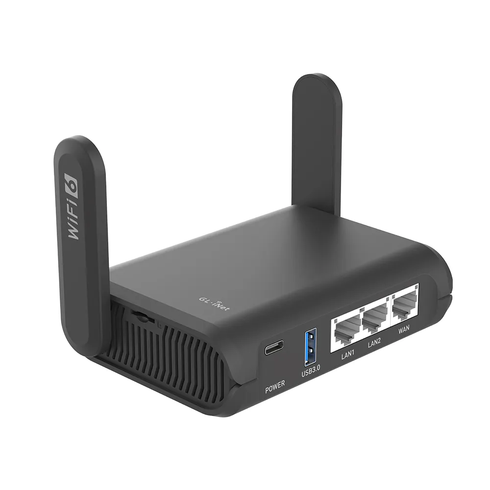

# Edge Router

## Purpose

The edge router provides **upstream connectivity** between the site and the external network (ISP, travel router, or host network).

Edge routers are **external** to the site — they provide connectivity but are not managed by Deevnet automation. Configuration is manual or vendor-managed. The site assumes each edge router provides DHCP on its LAN interface (for bootstrap node or core router upstream connectivity).


graph LR
    A[Edge Router unmanaged] <--> B[Core Router managed] <--> C[Site Hosts]


---

## Hardware Platform

**Site**: mobile (mobile)

The GL-AXT1800 Slate AX is a portable Wi-Fi 6 travel router used as the edge router for the mobile site. It provides upstream connectivity when traveling — connecting to hotel Wi-Fi, tethered phones, or any available network.

### Hardware

| Attribute | Value |
|-----------|-------|
| **Model** | GL-iNet GL-AXT1800 (Slate AX) |
| **CPU** | IPQ6000 1.2GHz quad-core |
| **Memory** | 512MB DDR3L |
| **Storage** | 128MB NAND Flash |
| **Ethernet** | 3x Gigabit (1 WAN, 2 LAN) |
| **Wi-Fi** | Wi-Fi 6 (802.11ax) dual-band, 1800Mbps |
| **USB** | USB 3.0 |
| **Power** | USB-C, <8.75W max |
| **Dimensions** | 125 x 82 x 36mm |
| **Weight** | 245g |

### Selection Rationale

- **Portability**: Compact form factor with retractable antennas fits in a laptop bag
- **Flexible upstream**: Can connect via Ethernet, Wi-Fi repeater, or USB tethering
- **OpenWrt-based**: Runs standard OpenWrt with full package ecosystem
- **VPN capable**: WireGuard and OpenVPN at near-gigabit speeds
- **Power efficient**: Runs from USB-C power bank if needed

### Operating System

| Attribute | Value |
|-----------|-------|
| **OS** | OpenWrt |
| **Version** | [Software Catalog](/docs/platforms/software-catalog/#switching-wireless-and-edge) |
| **Base** | GL-iNet firmware (OpenWrt fork) |

### Roles

| Role | Description |
|------|-------------|
| **WAN connectivity** | Connects to upstream network (hotel, tether, etc.) |
| **NAT** | Masquerades substrate traffic |
| **DHCP** | Provides IP to core router WAN interface |
| **Wi-Fi repeater** | Extends upstream Wi-Fi to wired connection |

