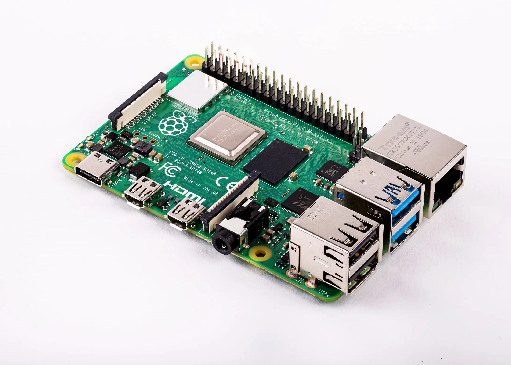

# Raspberry Pi

## Purpose

The Raspberry Pi bank provides a **development and prototyping platform** for edge compute, IoT, and clustering experiments. The Pis function as a reusable workbench—when a project is complete, the SD card becomes the deliverable and a new Pi4 is purchased for permanent deployment.

Goals:
- **SD card as product** — Develop on the bank, deploy the card to dedicated hardware
- **Swappable experiments** — Swap SD cards in/out for different projects or clustering configurations
- **Prototyping platform** — Test configurations before committing to permanent hardware

---

## Hardware

**Site**: mobile (mobile)

| Quantity | Model | RAM | Notes |
|----------|-------|-----|-------|
| 4 | Raspberry Pi 4 Model B | 8GB | Development bank |

### Selection Rationale

| Attribute | Value | Rationale |
|-----------|-------|-----------|
| **Model** | Pi 4 Model B | Mature platform, broad software support |
| **RAM** | 8GB | Maximum available, supports heavier workloads |
| **Quantity** | 4 units | Enables clustering experiments (K3s, etc.) |
| **Form factor** | Standard Pi | Compatible with cases, HATs, accessories |

---

## Network Position


graph LR
    A[Core Router] <--> B[Access Switch IoT VLAN] <--> C[Raspberry Pi Bank 4x Pi4 8GB]


Pis are placed on the IoT network segment for isolation from management workloads.

---

## Operating System

| Attribute | Value |
|-----------|-------|
| **OS** | Raspberry Pi OS (64-bit) or Fedora ARM |
| **Provisioning** | SD card imaging via deevnet-image-factory |

---

## Use

How the bank is used — building an image, testing on a bank Pi, and graduating a project to
dedicated hardware — is the [Pi Lab](/docs/runbook/tenant/pi-lab/) in Tenant Operations. Projects
that have graduated are under [Completed Projects](/docs/completed/).
