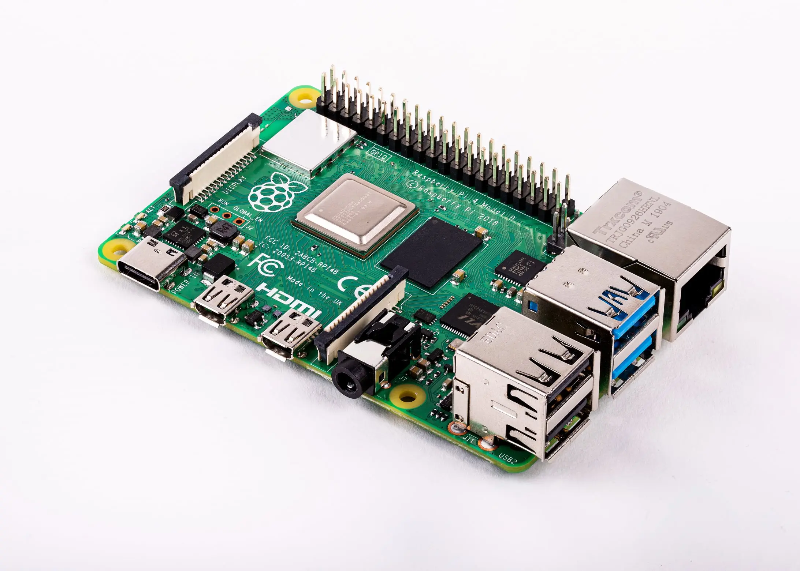

# Raspberry Pis

## Purpose

The Raspberry Pi bank provides a **development and prototyping platform** for edge compute, IoT, and clustering experiments. The Pis function as a reusable workbench—when a project is complete, the SD card becomes the deliverable and a new Pi4 is purchased for permanent deployment.

Goals:
- **SD card as product** — Develop on the bank, deploy the card to dedicated hardware
- **Swappable experiments** — Swap SD cards in/out for different projects or clustering configurations
- **Prototyping platform** — Test configurations before committing to permanent hardware

---

## Hardware

**Substrate**: dvntm (mobile)

| Quantity | Model | RAM | Notes |
|----------|-------|-----|-------|
| 4 | Raspberry Pi 4 Model B | 8GB | Development bank |



### Selection Rationale

| Attribute | Value | Rationale |
|-----------|-------|-----------|
| **Model** | Pi 4 Model B | Mature platform, broad software support |
| **RAM** | 8GB | Maximum available, supports heavier workloads |
| **Quantity** | 4 units | Enables clustering experiments (K3s, etc.) |
| **Form factor** | Standard Pi | Compatible with cases, HATs, accessories |

---

## Operating System

| Attribute | Value |
|-----------|-------|
| **OS** | Raspberry Pi OS (64-bit) or Fedora ARM |
| **Provisioning** | SD card imaging via deevnet-image-factory |

### Automation Capability

- **Image provisioning**: deevnet-image-factory builds Pi images
- **cloud-init**: Supported for initial configuration
- **Ansible**: Post-boot configuration via `deevnet.builder`

---

## Workflow

### Development Cycle

1. **Select project** — Choose workload (K3s node, SDR gateway, sensor collector, etc.)
2. **Image SD card** — Flash image from deevnet-image-factory
3. **Develop on bank** — Use one or more Pis from the bank for development
4. **Validate** — Test configuration, iterate as needed
5. **Finalize SD card** — The working SD card is the deliverable
6. **Deploy permanently** — Purchase new Pi4, insert finalized SD card

### Clustering Experiments

The 4-Pi bank supports multi-node experiments:

| Configuration | Use Case |
|---------------|----------|
| **4-node cluster** | K3s/K8s testing, distributed systems |
| **3+1** | 3-node cluster + 1 control/monitoring |
| **2+2** | Two separate 2-node experiments |
| **4 independent** | Four different single-node projects |

SD cards can be swapped to reconfigure the bank for different experiments.

---

## Network Position

```
┌─────────────────┐      ┌──────────────────┐      ┌─────────────────────┐
│  Core Router    │◄────►│  Access Switch   │◄────►│  Raspberry Pi Bank  │
│                 │      │  (IoT VLAN)      │      │  (4x Pi4 8GB)       │
└─────────────────┘      └──────────────────┘      └─────────────────────┘
```

Pis are placed on the IoT network segment for isolation from management workloads.

---

## Potential Roles

| Role | Description |
|------|-------------|
| **K3s cluster** | Lightweight Kubernetes for container orchestration |
| **SDR gateway** | Software-defined radio signal processing |
| **Sensor collection** | IoT sensor aggregation and forwarding |
| **Home automation** | Home Assistant or similar platforms |
| **Display/kiosk** | Information displays, dashboards |

---

## Image Factory Integration

Pi images are built via the **deevnet-image-factory** repository:

1. **Base image**: Raspberry Pi OS or Fedora ARM
2. **cloud-init**: Pre-configured for substrate connectivity
3. **Ansible user**: Provisioned for automation access
4. **Artifact staging**: Images stored on artifact server

---

## Permanent Deployment

When a project graduates from the development bank:

1. **Document configuration** — Capture working setup in Ansible/docs
2. **Purchase Pi4** — Buy dedicated hardware for permanent role
3. **Transfer SD card** — Move finalized card to new hardware
4. **Reclaim bank slot** — Bank Pi returns to available pool

This model keeps the development bank available for new experiments while completed projects run on dedicated hardware.
